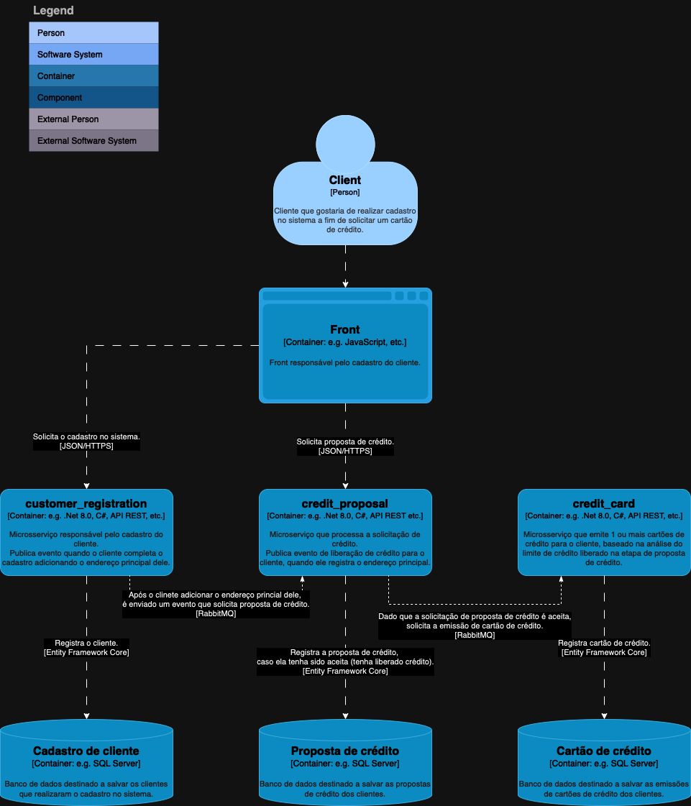

# ms-credit-card-context
Documentation and source code.

Context:

Register a new customer via API and communicate via messaging:

1- Generate a credit proposal;

2- Issue 1 or more credit cards;

Considering that there may be communication failures in the credit proposal or in the issuance of the card, there must be a resilience process and signaling via event to the customer microservice, for this purpose retry and deadletter were used.

Microservices:

1- Customer registration;
#### https://github.com/gabrielleraujo/customer-registration
2- Credit proposal;
#### https://github.com/gabrielleraujo/credit-proposal
3- Credit card;
#### https://github.com/gabrielleraujo/credit-card

### C4 models:

